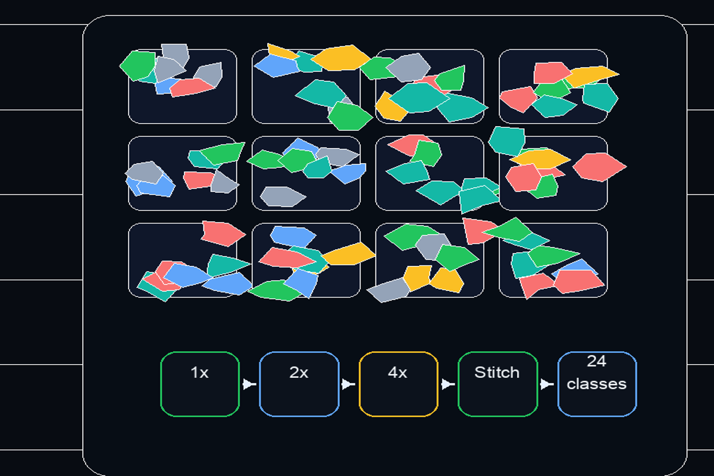
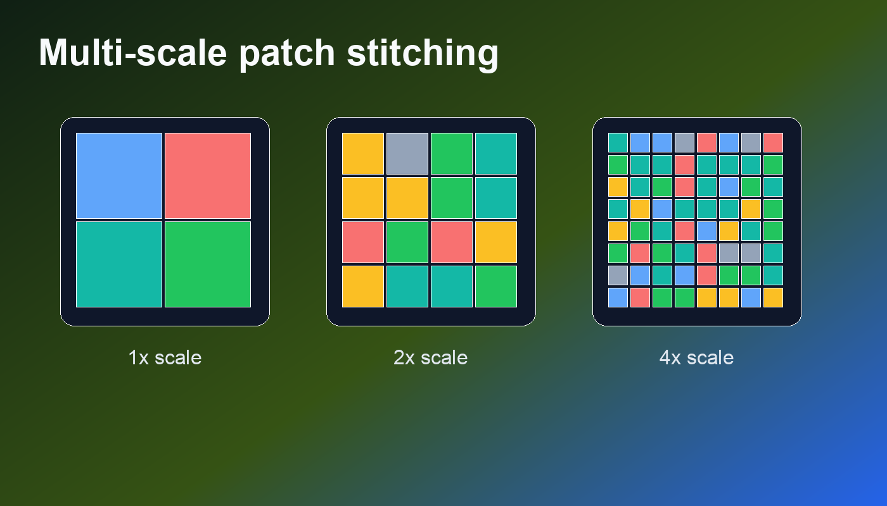
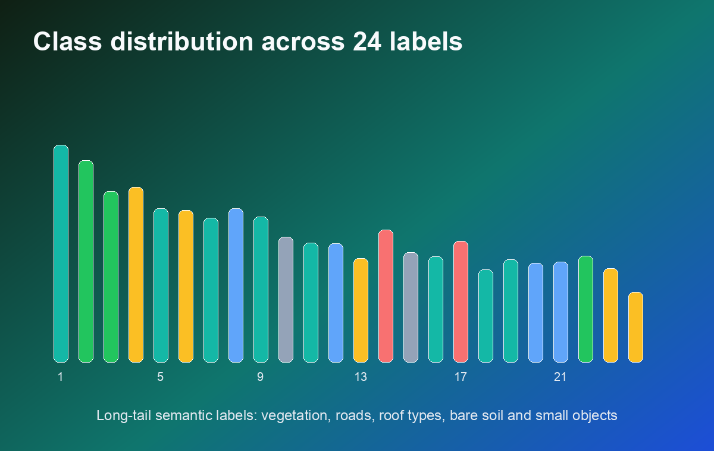
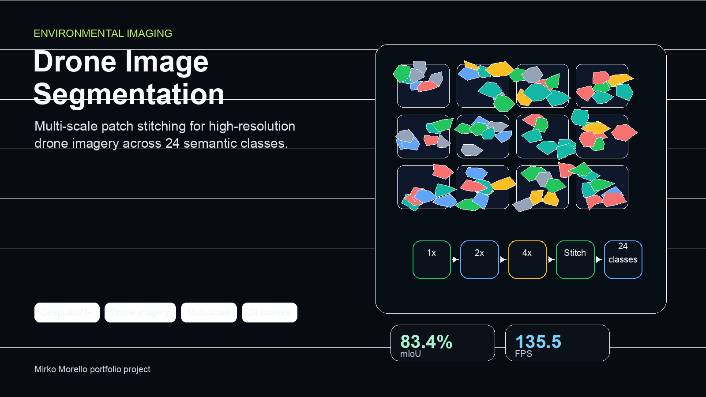

# Semantic Segmentation of High-Resolution Aerial Drone Imagery

> **Master's Thesis Project** - Signal and Imaging Acquisition and Modelling in Environment
> **Author:** Mirko Morello (920601)
> **Institution:** University of Milano-Bicocca

<p align="center">
  
</p>

## 📋 Table of Contents

- [Overview](#overview)
- [Key Features](#key-features)
- [Methodology](#methodology)
  - [Patch-Based Processing](#patch-based-processing)
  - [Multi-Scale Stitch Levels](#multi-scale-stitch-levels)
  - [Model Architectures](#model-architectures)
- [Dataset](#dataset)
- [Results](#results)
- [Installation](#installation)
- [Usage](#usage)
- [Project Structure](#project-structure)
- [Technologies](#technologies)
- [Future Work](#future-work)
- [References](#references)

## 🎯 Overview

This project tackles the challenging problem of **semantic segmentation on extremely high-resolution aerial images** (6000×4000 pixels) captured by drones. Due to computational and memory constraints, processing such large images at once is infeasible.

The solution implements a robust **patch-based approach with multi-scale analysis** to ensure both local detail accuracy and global contextual understanding. The system achieves **91.14% accuracy** and **83.36% mIoU** using DeepLabV3+ with ResNet34, making it suitable for:

- 🌍 **Environmental monitoring**
- 🏙️ **Urban planning and land use mapping**
- 🚁 **Autonomous drone navigation and landing**
- 🌾 **Precision agriculture**

## ✨ Key Features

### 🔬 Novel Multi-Scale "Stitch Level" Approach
- Processes patches at multiple zoom levels (1×, 2×, 4×) simultaneously
- Captures both fine details and broader spatial context
- Resizes all patches to uniform input size while preserving multi-scale information

### 🧩 Intelligent Patch-Based Processing
- Divides large images into manageable 1000×1000 pixel patches
- Optimal balance between computational efficiency and context capture
- Efficient reconstruction from patches for full-resolution predictions

### 🎯 State-of-the-Art Deep Learning Models
- **DeepLabV3+ with ResNet34** (91.14% accuracy, 83.36% mIoU)
- **DeepLabV3+ with EfficientNet-B5** (89.69% accuracy, 81.96% mIoU)
- **Custom U-Net inspired architecture** with ASPP and attention mechanisms

### ⚡ Real-Time Performance Optimization
- Achieves **29.57 FPS** on NVIDIA RTX 3090 (1000px patches)
- **135.53 FPS** with 2000px patches (slight accuracy trade-off)
- Gradient accumulation for memory-efficient training
- Mixed precision training support

## 🔬 Methodology

### Patch-Based Processing

Processing 6000×4000 pixel images with deep neural networks presents significant computational challenges. The solution divides each image into smaller, overlapping patches that can be processed efficiently by a GPU.

**Patch Size Analysis:**
| Patch Size | Patches per Image | Accuracy | Best Use Case |
|------------|------------------|----------|---------------|
| 500×500 | 96 (127 with stitching) | 84.83% | Fine detail focus |
| **1000×1000** | **24 (31 with stitching)** | **89.73%** | **Optimal balance** ✅ |
| 2000×2000 | 4 (5 with stitching) | 86.54% | Speed priority |

### Multi-Scale "Stitch Level" Approach

<p align="center">
  
</p>

For each image, patches are generated at multiple scales:

```
For level ℓ ∈ [0, L-1]:
    P_ℓ = P · 2^ℓ
```

Where:
- `P` = base patch size (e.g., 1000×1000)
- `L` = number of stitch levels
- `P_ℓ` = patch size at level ℓ

**Benefits:**
- Captures features at various spatial resolutions simultaneously
- Improves model understanding of both local details and global context
- Enhances segmentation performance, especially for objects of varying sizes

### Model Architectures

#### 1️⃣ DeepLabV3+ with ResNet34 (Best Overall Performance)

**Architecture Highlights:**
- **Encoder:** ResNet34 (34-layer residual network with skip connections)
- **ASPP Module:** Atrous Spatial Pyramid Pooling with multiple dilation rates (1, 12, 24, 36)
- **Decoder:** Lightweight decoder combining multi-scale features
- **Parameters:** 22,443,368
- **Performance:** 91.14% accuracy, 83.36% mIoU, 29.57 FPS

**Advantages:**
- Consistent performance across most classes
- Lighter architecture allows larger batch sizes
- Pre-trained on ImageNet for transfer learning
- Balanced accuracy and computational efficiency

#### 2️⃣ DeepLabV3+ with EfficientNet-B5 (Best for Small Objects)

**Architecture Highlights:**
- **Encoder:** EfficientNet-B5 with compound scaling
- **Parameters:** 28,445,656
- **Performance:** 89.69% accuracy, 81.96% mIoU, 10.20 FPS

**Advantages:**
- Superior segmentation of small and challenging objects (dogs, fence-poles, windows)
- More complex architecture captures fine-grained details
- Parameter-efficient design

#### 3️⃣ Custom Segmentation Model

**Architecture Highlights:**
- **Design:** U-Net inspired encoder-decoder with skip connections
- **ASPP Module:** Multi-scale context aggregation
- **Attention Blocks:** Channel and spatial attention mechanisms
- **Parameters:** 9,341,600
- **Performance:** 78.41% accuracy, 63.35% mIoU

**Features:**
- Encoder: 4 downsampling blocks (32→64→128→256 channels)
- Bridge: ASPP with dilations (6, 12, 18)
- Decoder: 4 upsampling blocks with attention
- Compact architecture (3× fewer parameters than ResNet34)

### Data Augmentation Pipeline

Extensive augmentation using **Albumentations** library:

```python
- Geometric: RandomRotate90, Flip, ShiftScaleRotate
- Color: RandomBrightnessContrast, HueSaturationValue, RandomGamma
- Noise: GaussNoise, GaussianBlur, MotionBlur
- Normalization: ImageNet statistics (μ=[0.485, 0.456, 0.406], σ=[0.229, 0.224, 0.225])
- Resize: 256×256 (final patch size)
```

### Training Details

**Optimizer:** AdamW
- Learning rate: 2e-4
- Weight decay: 1e-4

**Scheduler:** Cosine Annealing (20-100 epochs)

**Loss Function:** Cross-Entropy Loss

**Advanced Techniques:**
- **Gradient Accumulation:** Simulates larger batch sizes with limited GPU memory
- **Mixed Precision Training:** FP16/FP32 for faster training
- **Early Stopping:** Patience of 14 epochs
- **Custom Batch Normalization Accumulation:** Accurate statistics with gradient accumulation

## 📊 Dataset

### Semantic Drone Dataset

- **Total Images:** 400 high-resolution aerial images
- **Resolution:** 6000×4000 pixels
- **Split:** 80% training (320 images) / 20% testing (80 images)
- **Annotation:** Pixel-wise hand-labeled segmentation masks
- **Environments:** Urban areas, rural landscapes, mixed terrain

### Semantic Classes (24 Total)

| Category | Classes |
|----------|---------|
| **Terrain** | unlabeled, paved-area, dirt, grass, gravel, water, rocks |
| **Structures** | pool, roof, wall, window, door, fence, fence-pole |
| **Vegetation** | vegetation, tree, bald-tree |
| **Objects** | person, dog, car, bicycle, ar-marker, obstacle |
| **Other** | conflicting |

<p align="center">
  
</p>

**Challenges:**
- **Class imbalance:** Some classes (e.g., dog, door) have very few instances
- **Small objects:** Fence-poles, windows, and persons are difficult to segment
- **High variability:** Objects appear at different scales and orientations

## 📈 Results

### Model Comparison

| Architecture | Accuracy | mIoU | Dice Score | Loss | FPS (1000px) | Parameters |
|--------------|----------|------|------------|------|--------------|------------|
| **ResNet34** | **91.14%** | **0.8336** | **0.8969** | **0.2956** | **29.57** | 22.4M |
| EfficientNet-B5 | 89.69% | 0.8196 | 0.8859 | 0.3511 | 10.20 | 28.4M |
| Custom Model | 78.41% | 0.6335 | 0.7329 | 0.7403 | 16.93 | 9.3M |

### Per-Class IoU Performance (ResNet34)

| Class | IoU | Class | IoU |
|-------|-----|-------|-----|
| **paved-area** | **0.9351** | vegetation | 0.7004 |
| **grass** | **0.9390** | roof | 0.9012 |
| **pool** | **0.9390** | wall | 0.6446 |
| **car** | **0.9266** | tree | 0.6569 |
| **water** | **0.9251** | gravel | 0.7932 |
| person | 0.7134 | dirt | 0.5771 |
| rocks | 0.5395 | window | 0.5631 |

**Excellent performance (>90%):** Large homogeneous areas (paved-area, grass, pool, car, water)
**Good performance (70-90%):** Medium-sized objects (roof, gravel, person, vegetation)
**Challenging (<70%):** Small/rare objects (fence-pole, door, dog - dataset limitations)

### Speed vs Accuracy Trade-off

| Patch Size | IoU (Native) | IoU (1000px) | IoU (2000px) | FPS (Native) | FPS (1000px) | FPS (2000px) |
|------------|--------------|--------------|--------------|--------------|--------------|--------------|
| ResNet34 | 0.6638 | **0.8336** | 0.7910 | 135.53 | **29.57** | **87.20** |
| EfficientNet-B5 | 0.6603 | 0.8196 | 0.7868 | 40.66 | 10.20 | 28.58 |

**Finding:** 2000px patches provide ~3× speed improvement with <6% IoU reduction

### Visualization Examples

<p align="center">
  
</p>

**Confidence Heatmap:** Shows model certainty (bright = confident)
**Entropy Map:** Highlights prediction uncertainty (dark = certain, bright = uncertain)
**Overlay:** Predicted segmentation on original image

## 🚀 Installation

### Prerequisites

- Python 3.8+
- CUDA-capable GPU (recommended: ≥8GB VRAM)
- NVIDIA CUDA Toolkit 11.0+

### Setup

```bash
# Clone the repository
git clone https://github.com/MirkoMorello/MSc_Environmental_Imaging.git
cd MSc_Environmental_Imaging/Final_Project

# Create virtual environment
python -m venv venv
source venv/bin/activate  # On Windows: venv\Scripts\activate

# Install dependencies
pip install torch torchvision torchaudio --index-url https://download.pytorch.org/whl/cu118
pip install segmentation-models-pytorch
pip install albumentations opencv-python pandas numpy matplotlib pillow tqdm scikit-learn

# For Kaggle dataset download
pip install kaggle
```

### Download Dataset

1. Get Kaggle API credentials from [kaggle.com/account](https://www.kaggle.com/account)
2. Place `kaggle.json` in `~/.kaggle/`
3. Run the notebook cells or:

```python
from kaggle.api.kaggle_api_extended import KaggleApi
api = KaggleApi()
api.authenticate()
api.dataset_download_files('bulentsiyah/semantic-drone-dataset')
```

## 💻 Usage

### Quick Start - Inference

```python
import torch
import segmentation_models_pytorch as smp
from dataset import ImagePatchDataset
from utils import *

# Load pre-trained model
device = torch.device("cuda" if torch.cuda.is_available() else "cpu")
model = smp.create_model(
    arch='DeepLabV3Plus',
    encoder_name='resnet34',
    encoder_weights=None,  # We'll load custom weights
    classes=24,
    in_channels=3
)
model.load_state_dict(torch.load('models/DeepLabV3Plus_resnet34_100epochs_bs6_secondRun_best.pth'))
model = model.to(device)
model.eval()

# Prepare test dataset
test_dataset = ImagePatchDataset(
    df=test_df,
    img_dir='./dataset/original_images/',
    mask_dir='./dataset/label_images_semantic/',
    patch_size=(1000, 1000),
    overlap=0,
    transform=valtest_transform,
    use_torch=True
)

# Run inference
visualize_predictions_with_heatmap(model, test_dataset, idx=0, device=device, classes=classes)
```

### Training from Scratch

```python
from models import CustomSegmentationModel
from torch.utils.data import DataLoader
import torch.nn as nn

# Initialize model
model = smp.create_model(
    arch='DeepLabV3Plus',
    encoder_name='resnet34',
    encoder_weights='imagenet',
    classes=24
)

# Setup training
train_loader = DataLoader(train_dataset, batch_size=1, shuffle=True, num_workers=8)
test_loader = DataLoader(test_dataset, batch_size=1, shuffle=False, num_workers=8)

criterion = nn.CrossEntropyLoss()
optimizer = torch.optim.AdamW(model.parameters(), lr=2e-4, weight_decay=1e-4)
scheduler = torch.optim.lr_scheduler.CosineAnnealingLR(optimizer, num_epochs)

# Train
history = train_model(
    epochs=100,
    model=model,
    train_loader=train_loader,
    val_loader=test_loader,
    criterion=criterion,
    optimizer=optimizer,
    scheduler=scheduler,
    device=device,
    experiment_name='my_experiment',
    accumulation_steps=4,  # For memory-limited GPUs
    use_amp=True  # Mixed precision
)
```

### Jupyter Notebook Workflow

Open `Final_Project/main.ipynb` for the complete pipeline:

1. **Dataset Preparation** - Download and setup
2. **Data Augmentation** - Configure transforms
3. **Training** - Train models with various configurations
4. **Evaluation** - Test on validation set
5. **Visualization** - Generate prediction heatmaps and overlays

## 📁 Project Structure

```
MSc_Environmental_Imaging/
│
├── Final_Project/
│   ├── main.ipynb              # Main Jupyter notebook with full pipeline
│   ├── models.py               # Model architectures (CustomNet, CustomSegmentationModel)
│   ├── dataset.py              # ImagePatchDataset class with multi-scale stitching
│   ├── utils.py                # Utility functions (losses, reconstruction, metrics)
│   ├── Project_Report.pdf      # Complete academic report (10 pages)
│   ├── Lecture 14.pdf          # Course materials
│   └── Lecture 19.pdf
│
├── Lessons_notes/              # Course lesson notes and assignments
│   ├── L01/ ... L17/          # Individual lesson folders
│   └── Project_Report.pdf      # Consolidated notes
│
├── README.md                   # This file
├── LICENSE                     # MIT License
└── .gitignore
```

### Key Files

- **`models.py`** - Contains three model implementations:
  - `CustomNet`: First iteration U-Net style model
  - `CustomSegmentationModel`: Advanced model with ASPP + Attention (used in paper)
  - Commented experimental architectures

- **`dataset.py`** - `ImagePatchDataset` class:
  - Multi-scale patch generation (stitch levels)
  - Supports both NumPy and PyTorch patch creation
  - Albumentations transform integration
  - Efficient patch reconstruction

- **`utils.py`** - Helper functions:
  - `FocalLoss` and `DiceLoss` implementations
  - `fast_reconstruct_from_patches`: Efficient GPU-based reconstruction
  - `safe_pickle_dump/load`: Checkpoint management
  - `convert_to_numpy`: Tensor conversion utilities

## 🛠️ Technologies

### Deep Learning Frameworks
- **PyTorch** 2.0+ - Core deep learning framework
- **Segmentation Models PyTorch** - Pre-trained segmentation architectures
- **timm** - Transfer learning backbones

### Computer Vision & Data Processing
- **Albumentations** - Advanced data augmentation
- **OpenCV** (cv2) - Image processing operations
- **Pillow** - Image I/O
- **NumPy** - Numerical computations

### Experiment Tracking & Visualization
- **Matplotlib** - Plotting and visualization
- **tqdm** - Progress bars
- **pandas** - Data management

### Model Architectures Used
- **DeepLabV3+** - State-of-the-art semantic segmentation
- **ResNet34** - 34-layer residual network
- **EfficientNet-B5** - Efficient compound scaling architecture
- **U-Net** - Medical image segmentation (inspiration for custom model)
- **ASPP** - Atrous Spatial Pyramid Pooling
- **Attention Mechanisms** - Channel and spatial attention

## 🔮 Future Work

### Dataset Enhancement
- [ ] Expand dataset size and diversity
- [ ] Address class imbalance (especially rare objects: dogs, doors, fence-poles)
- [ ] Collect more instances of challenging classes
- [ ] Include varying weather and lighting conditions

### Model Improvements
- [ ] Experiment with newer architectures (Swin Transformer, SegFormer)
- [ ] Implement test-time augmentation (TTA)
- [ ] Explore ensemble methods
- [ ] Investigate self-supervised pre-training on aerial imagery

### Computational Optimization
- [ ] Leverage high-performance computing clusters
- [ ] Implement distributed training (multi-GPU)
- [ ] Model quantization for edge deployment
- [ ] ONNX export for cross-platform inference

### Advanced Techniques
- [ ] Domain adaptation for different drone types/cameras
- [ ] Active learning to reduce annotation effort
- [ ] Temporal consistency for video streams
- [ ] Real-time optimization for on-drone inference

### Applications
- [ ] Integration with autonomous navigation systems
- [ ] Change detection over time (multi-temporal analysis)
- [ ] 3D reconstruction integration
- [ ] Mobile/edge device deployment

## 📚 References

### Key Papers

1. **DeepLab** - Chen, L. C., et al. (2017). "DeepLab: Semantic Image Segmentation with Deep Convolutional Nets, Atrous Convolution, and Fully Connected CRFs." *IEEE TPAMI*, 40(4), 834-848.

2. **DeepLabV3+** - Chen, L. C., et al. (2018). "Encoder-Decoder with Atrous Separable Convolution for Semantic Image Segmentation." *ECCV 2018*.

3. **ResNet** - He, K., et al. (2016). "Deep Residual Learning for Image Recognition." *CVPR 2016*.

4. **EfficientNet** - Tan, M., & Le, Q. V. (2019). "EfficientNet: Rethinking Model Scaling for Convolutional Neural Networks." *ICML 2019*.

5. **U-Net** - Ronneberger, O., et al. (2015). "U-Net: Convolutional Networks for Biomedical Image Segmentation." *MICCAI 2015*.

6. **Attention Mechanisms** - Vaswani, A., et al. (2017). "Attention Is All You Need." *NeurIPS 2017*.

7. **Batch Normalization** - Ioffe, S., & Szegedy, C. (2015). "Batch Normalization: Accelerating Deep Network Training by Reducing Internal Covariate Shift." *ICML 2015*.

### Dataset

**Semantic Drone Dataset** - Available on [Kaggle](https://www.kaggle.com/datasets/bulentsiyah/semantic-drone-dataset)

### Full Bibliography

See `Final_Project/Project_Report.pdf` for complete references (page 10).

## 📄 License

This project is licensed under the **MIT License** - see the [LICENSE](LICENSE) file for details.

## 👤 Author

**Mirko Morello**
- Student ID: 920601
- Email: m.morello11@campus.unimib.it
- University: Milano-Bicocca
- Course: MSc in Environmental Imaging

## 🙏 Acknowledgments

- **Course:** Signal and Imaging Acquisition and Modelling in Environment
- **Institution:** University of Milano-Bicocca
- **Dataset:** Semantic Drone Dataset contributors
- **Frameworks:** PyTorch, Segmentation Models PyTorch, Albumentations teams

---

<p align="center">
  <i>For detailed methodology, experiments, and analysis, please refer to the full academic report:</i><br>
  <a href="Final_Project/Project_Report.pdf"><b>📑 Project_Report.pdf</b></a>
</p>

<p align="center">
  <i>⭐ If you find this project useful, please consider giving it a star!</i>
</p>
