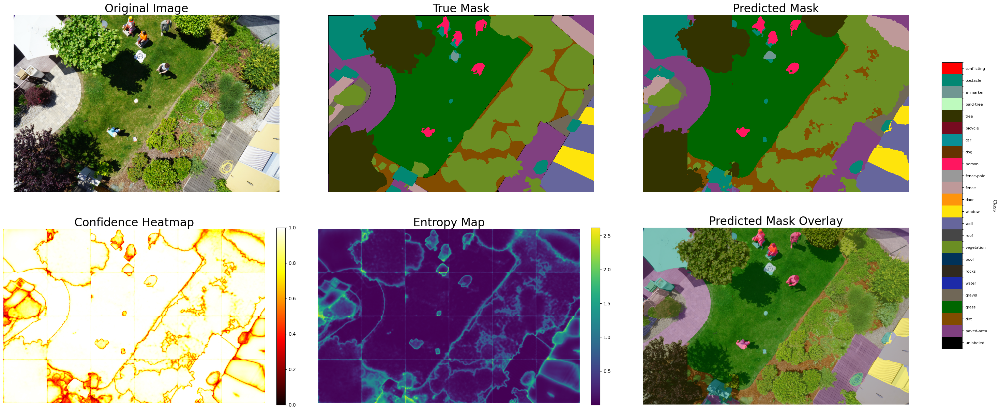
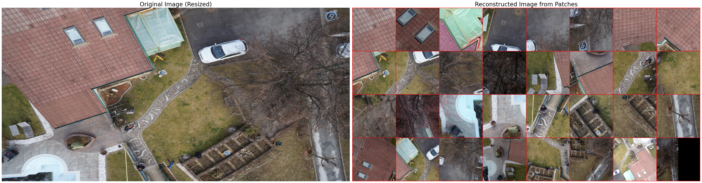

# Multi-Scale Semantic Segmentation of Aerial Drone Imagery


Semantic segmentation of very high-resolution drone images (6000×4000 px,
24 classes) from the Semantic Drone Dataset. Because the images are too
large to process whole, they are split into patches; a multi-scale "stitch
level" approach reconstructs predictions across scales to capture both fine
detail and broader context. DeepLabV3+ with a ResNet-34 backbone reaches
91.14% pixel accuracy, slightly ahead of an EfficientNet-B5 backbone and a
custom model. Per-pixel confidence and entropy maps accompany each
prediction.

Final project for the **Signal and Imaging Acquisition and Modelling in
Environment** course, MSc in Artificial Intelligence (University of
Milano-Bicocca).

<p align="center"></p>
<p align="center"><em>A test scene: input, ground-truth and predicted masks
over the 24-class palette, plus per-pixel confidence and entropy. Source:
report, Fig. 6.</em></p>

## Results

| Backbone (DeepLabV3+) | Pixel accuracy |
|---|---|
| ResNet-34 | 91.14% |
| EfficientNet-B5 | 89.69% |

The report also breaks down per-class IoU / mIoU and inference speed (FPS)
at different patch resolutions (1000 px vs 2000 px); ResNet-34 gives the
best accuracy/speed trade-off. Numbers from the report's results section.

## Approach

- **Data**: Semantic Drone Dataset, 6000×4000 px images with hand-labeled
  masks over 24 classes.
- **Patching**: images are divided into patches processed independently,
  then stitched back; a multi-scale ("stitch level") scheme mixes patch
  scales to balance local detail and global context.
- **Models**: DeepLabV3+ with ResNet-34 and EfficientNet-B5 backbones, plus
  a custom model; extensive augmentation (color, noise, blur).
- **Uncertainty**: softmax confidence and predictive entropy per pixel.

<p align="center"></p>
<p align="center"><em>Patch-based processing: the full aerial image and its
reconstruction from independently-processed patches. Source: report,
Fig. 2.</em></p>

## How to run

```sh
pip install torch torchvision segmentation-models-pytorch albumentations matplotlib jupyter
jupyter lab Final_Project/main.ipynb
```

The Semantic Drone Dataset is expected under `Final_Project/`.

## Report

Full write-up: [Project_Report.pdf](Final_Project/Project_Report.pdf) —
Mirko Morello.

## Data

Semantic Drone Dataset — Institute of Computer Graphics and Vision, TU Graz.
